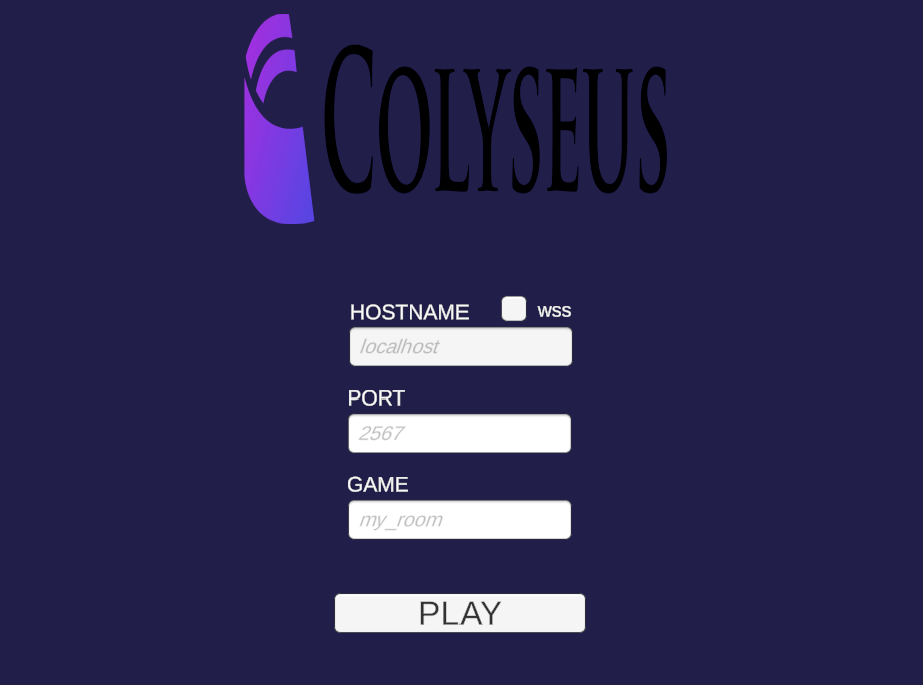
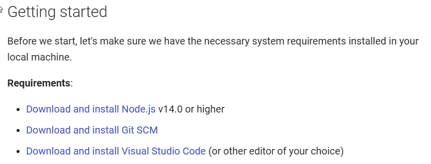
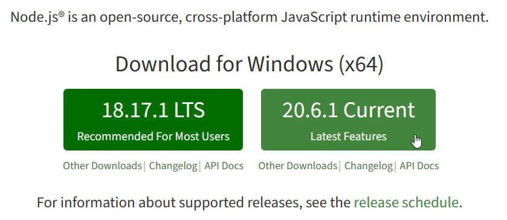
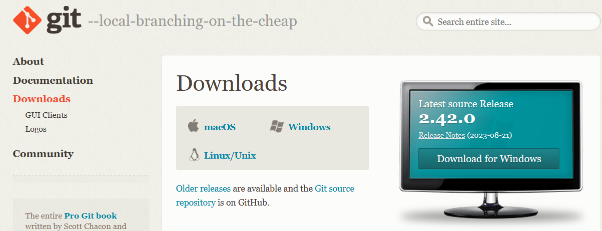
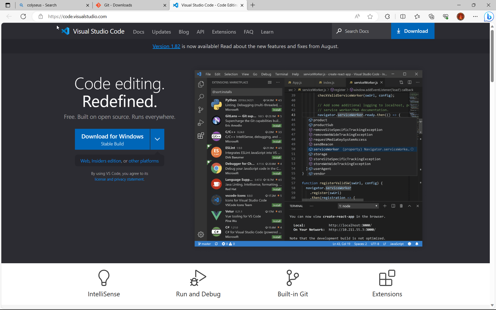
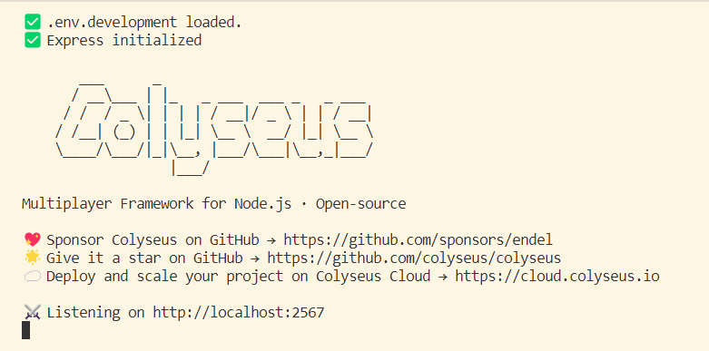
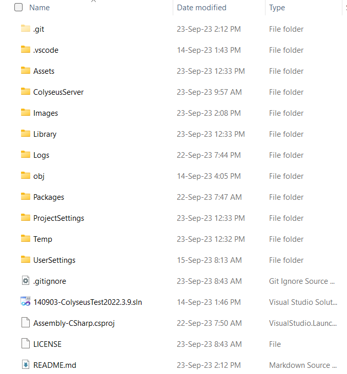
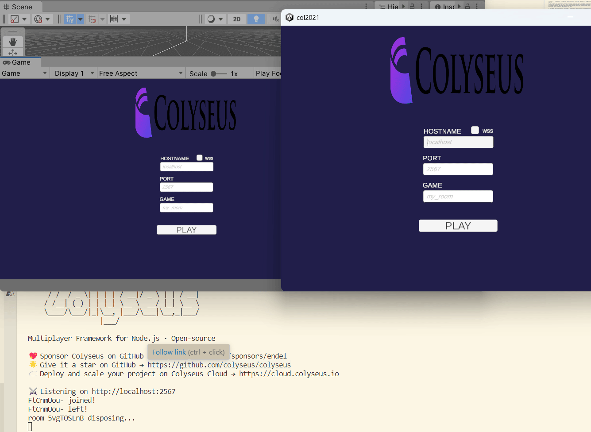

# ColyseusDemo
# Colyseus v0.15.4 server and client - Capsule demo using Unity 2022.3.9 

Colyseus is a framework for writing your own authoritative multiplayer game servers using JavaScript/TypeScript and Node.js.

In the world of game development, creating multiplayer games that can be enjoyed by players worldwide is an exciting challenge. To achieve this, you need a robust multiplayer server and a well-configured client. In this article, we'll walk you through the process of installing the Colyseus server and configuring the Unity client to set up a multiplayer gaming experience that players will love.

In this demo, the Unity client is configured to connect with the Colyseus server and access the capsule player from different remote clients, and moving it around the screen by clicking the mouse pointer from different positions.  

## Installing the Colyseus Server

* Prerequisites
Before we dive into installing the Colyseus server, make sure you have the following prerequisites in place:

Access the Colyseus' server documentation and follow the proposed step as prerequisites;

* 1 Node.js and npm: 
Ensure you have Node.js and npm (Node Package Manager) installed on your server. You can download them from the official Node.js website [https://nodejs.org/](https://nodejs.org/).

* 2 Install git SCM:
As part of the prerequisites, install the git tool from the website [https://git-scm.com/downloads](https://git-scm.com/downloads).

* 3 Install the Visual Studio Code:
Download and install the visual studio code for code editing. The link to download this tool is [https://code.visualstudio.com/](https://code.visualstudio.com/).

# Starting the Colyseus server
In order to start the Colyseus server, just use go to the server folder and then execute the following command

`c:\ColyseusServer\npm start`

Then the server would start and the following screen would appear>

Then the server would start using the 2567 port to attend user connections. 

* Part 2: Configuring the Unity Client
* Step 1: Set Up Your Unity Project
In Unity, create a new 3D project, depending on your game's requirements.

* Step 2: Copy and paste the files avobe for the Client for Unity
Once the Unity client y open, just copy all the folders avobe except the "ColyseusServer" and paste it over the Unity client folder structure. 

# Starting the clients in Unity 
In order to see client's connections and the multiplayer effect, you can use Unity's client test and a Windows compiled client. Then open the Windows client and introduce the Colyseus server information and the same in the second client in Unity.

Check that the capsule moves to where the player clicks in the two clients. 

